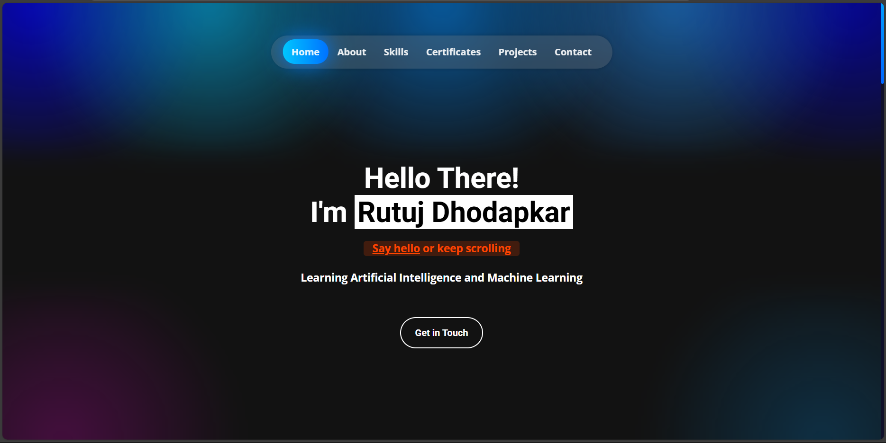
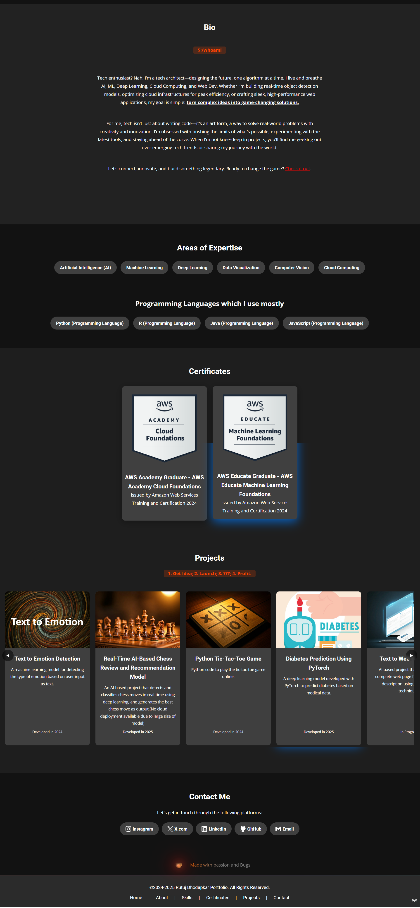

# Rutuj Dhodapkar - AI, ML, DL Developer Portfolio

Welcome to my Backend Developer Portfolio! This repository showcases my projects, technical skills, and experience in backend development.

## About Me

I am Rutuj Dhodapkar, a passionate AI developer with a deep understanding of designing scalable and efficient AI systems. I specialize in technologies like AI, ML, DL, Cloud Computing, Python, Java. My goal is to build high-performance, secure, and maintainable AI solutions.

## Portfolio Features

- **Projects**: Explore a variety of projects demonstrating my expertise in handling data storage, optimizing system performance, Developing AI/ DL large Systems.
- **Tech Stack**: Check out the technologies I work with.
- Languages:  Python, Java, R, Javascript

## How to View My Portfolio

You can check out my portfolio live at:  
[Portfolio](https://rutujdhodapkar.vercel.app)

Quick preview:

## Contact Me

Feel free to get in touch with me through the following platforms:

- LinkedIn: [Rutuj Dhodapkar](https://www.linkedin.com/in/rutuj-dhodapkar/)
- Email: [rutujdhodapkar@gmail.com](mailto:rutujdhodapkar@gmail.com)

## License

This project is open-source and available under the MIT License.
